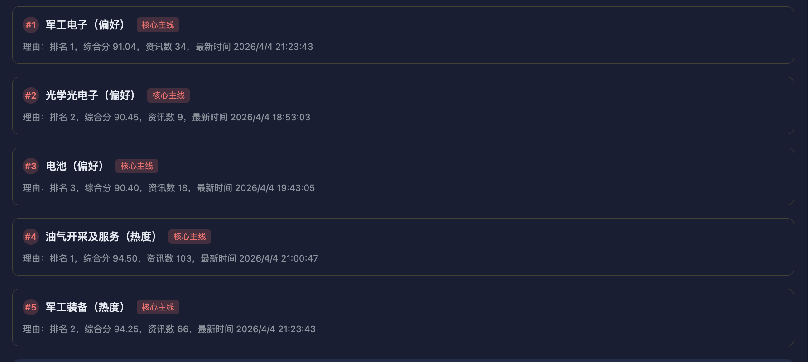

# 前端用户功能
### 1、盘前分析
### 2、每一条数据分析
### 3、投资倾向

#### 暂时已完成功能：获取数据库中每条新闻，，根据标签进行分类，可以根据全文内容搜索，可在标签分类的情况下进行搜索，并根据搜索结果统计利好，中性，利空的三种占比例
### ！！⚠️！！直接打开index.html使用，暂时使用json文件获取数据，具体数据等候后端传递
#
# 现有问题
### 1、主线分析时序号和数据库中的对不上，等后续数据库完善后再进行修改

### 2、动画效果暂时没有写